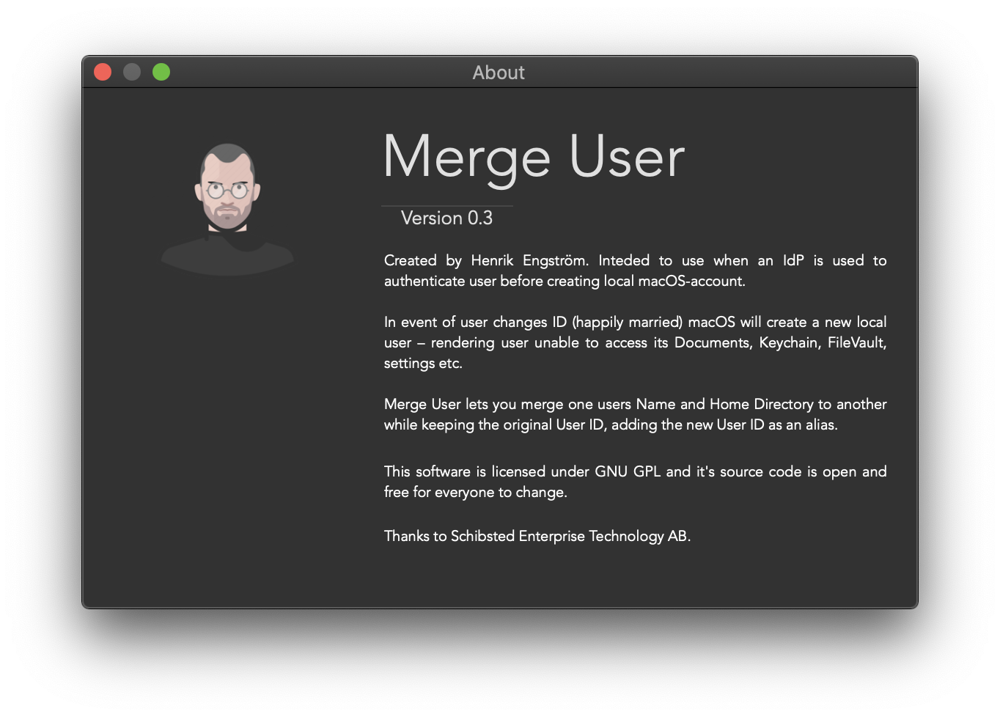
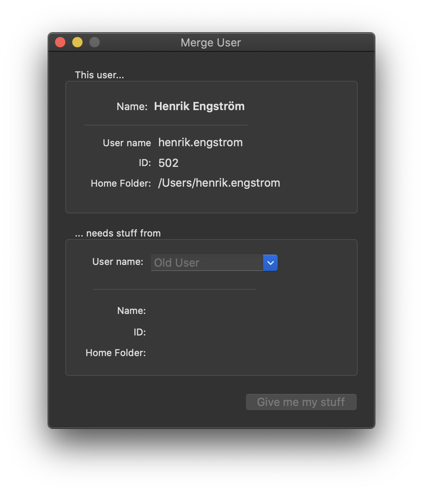

# Merge User
> Merge users in macOS.

A tool for Mac Administrators or users in an environment where an IdP is used to
authenticate users at macOS login screen.

In event of user changes ID (happily married) macOS will create a new local
user – rendering user unable to access its Documents, Keychain, FileVault, settings etc.



Merge User lets you merge one users Name and Home Directory to another while
keeping the original User ID, adding the new User ID as an alias.

## Installation

macOS:

1) Clone repository `git clone https://github.com/cr3ation/migrate-user/`
2) Open `Merge User.xcodeproj` in Xcode and build.

## Usage example

1) Start _Merge User.app_, current user is automatically selected.
2) Select user you want to merge in to using dropdown.
3) Click _Give me my stuff_ and ender password to start migration.
4) Reboot

_For more examples and usage, please refer to the [Wiki][wiki]._

## Release History

* 0.3.0
    * CHANGE: Moved to Git
* 0.2.9
    * CHANGE: Renamed to _Migrate User_
* 0.0.1
    * Work in progress

## Meta

Henrik Engström – me@henrikengstrom.com

Distributed under the GNU General Public License v3.0 license. See ``LICENSE`` for more information.

[https://github.com/cr3ation/merge-user](https://github.com/cr3ation)

## Contributing

1. Fork it (<https://github.com/cr3ation/merge-user/fork>)
2. Create your feature branch (`git checkout -b feature/fooBar`)
3. Commit your changes (`git commit -am 'Add some fooBar'`)
4. Push to the branch (`git push origin feature/fooBar`)
5. Create a new Pull Request

<!-- Markdown link & img dfn's -->
[travis-image]: https://img.shields.io/travis/dbader/node-datadog-metrics/master.svg?style=flat-square
[travis-url]: https://travis-ci.org/dbader/node-datadog-metrics
[wiki]: https://github.com/cr3ation/merge-user/wiki
